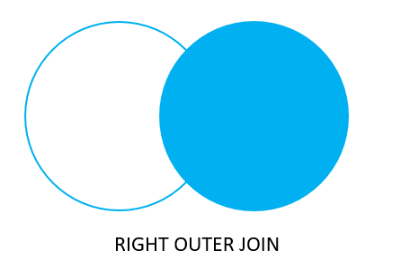

# DBMS JOINS NOTES

## Introduction
 PostgreSQL JOIN statements offer a powerful way to combine data from multiple tables based on shared columns. This enables you to retrieve and analyze diverse information across your database schema. This document explores the fundamental JOIN types in PostgreSQL, along with some special cases.

Basic JOIN Types
# 1. Inner Join:

- Combines rows with matching values in both tables.
- Only returns rows where a join condition is met.
- Ideal for retrieving related data where a one-to-one or one-to-many relationship exists.
### Example
```sql
CREATE TABLE Customers (
  customer_id SERIAL PRIMARY KEY,
  name VARCHAR(255) NOT NULL,
  email VARCHAR(255) UNIQUE NOT NULL
);

CREATE TABLE Orders (
  order_id SERIAL PRIMARY KEY,
  customer_id INTEGER REFERENCES Customers(customer_id) NOT NULL,
  order_date DATE NOT NULL,
  total_amount DECIMAL(10,2) NOT NULL
);

INSERT INTO Customers (name, email) VALUES
  ('John Doe', 'john.doe@example.com'),
  ('Jane Smith', 'jane.smith@example.com'),
  ('Mike Jones', 'mike.jones@example.com');

INSERT INTO Orders (customer_id, order_date, total_amount) VALUES
  (1, '2024-01-10', 50.00),
  (1, '2024-02-05', 25.00),
  (2, '2024-01-20', 75.00),
  (3, '2024-02-08', 100.00);
```
#### Customer Table


#### Orders Table


```sql
SELECT *
FROM Customers c
INNER JOIN Orders o ON c.customer_id = o.customer_id;
```

#### After inner Join


As seen in the above output, the inner join returns a result set that contains row in the left table that matches the row in the right table.

The Venn diagram for INNER JOIN is as below:


## Let's take another example 
```sql
CREATE TABLE zoo_1 (
    id INT PRIMARY KEY,
    animal VARCHAR (100) NOT NULL
);

CREATE TABLE zoo_2 (
    id INT PRIMARY KEY,
    animal VARCHAR (100) NOT NULL
);

INSERT INTO zoo_1(id, animal)
VALUES
    (1, 'Lion'),
    (2, 'Tiger'),
    (3, 'Wolf'),
    (4, 'Fox');
	
INSERT INTO zoo_2(id, animal)
VALUES
    (1, 'Tiger'),
    (2, 'Lion'),
    (3, 'Rhino'),
    (4, 'Panther');
	
	
SELECT *
FROM zoo_1 
INNER JOIN zoo_2 ON zoo_1.animal = zoo_2.animal;

```

### Let's look at the tables how it looks 
Zoo_1 table Looks Like this 


Zoo_2 table Looks Like this


## Now Inner Join of these two tables 


# 2.  LEFT JOIN
  In PostgreSQL, the `LEFT JOIN` (also known as `LEFT OUTER JOIN`) is a powerful tool for combining data from two tables, even when matching rows aren't present in both. It ensures all rows from the "left" table are included in the result, along with their corresponding matches from the "right" table if available. If no match exists, the right table's columns are filled with `NULL` values.

## Understanding the Concept
  Imagine you have two zoo tables:

* `zoo_1`: Stores animal IDs and their species.
* `zoo_2`: Tracks additional details like weight and diet, but only for a subset of animals in zoo_1.

A LEFT JOIN lets you retrieve all animals from `zoo_1` along with their corresponding weight and diet from `zoo_2` (if available). This is useful for scenarios like
* Finding all animals, even those without details in `zoo_2`.
* Identifying animals missing specific information in `zoo_2`.

>Syntax: 
```sql
SELECT column1, column2, ...
FROM table1
LEFT JOIN table2 ON table1.join_column = table2.join_column;
```

## Example: Combining Animal Data
```sql
SELECT *
FROM zoo_1 
LEFT JOIN zoo_2 ON zoo_1.id = zoo_2.id;
```
### The result:


As you can see, all animals from zoo_1 are included

The Venn diagram for a LEFT JOIN is as below:


# 3. RIGHT JOIN

The `RIGHT JOIN` or `RIGHT OUTER JOIN` works exactly opposite to the LEFT JOIN. It returns a complete set of rows from the right table with the matching rows if available from the left table. If there is no match, the left side will have null values.

```sql
SELECT *
FROM orders AS o
RIGHT JOIN customers AS c ON o.customer_id = c.customer_id;
```


The Venn diagram for a RIGHT OUTER JOIN is below:



# 4. FULL OUTER JOIN

The full outer join or full join returns a result set that contains all rows from both the left and right tables, with the matching rows from both sides where available. If there is no match, the missing side contains null values.

### EXAMPLE
```sql
CREATE TABLE products (
  product_id SERIAL PRIMARY KEY,
  name VARCHAR(255) NOT NULL,
  price DECIMAL(10,2) NOT NULL
);

CREATE TABLE categories (
  category_id SERIAL PRIMARY KEY,
  name VARCHAR(255) NOT NULL
);

CREATE TABLE product_categories (
  product_id INTEGER NOT NULL REFERENCES products(product_id),
  category_id INTEGER NOT NULL REFERENCES categories(category_id),
  PRIMARY KEY (product_id, category_id)
);


INSERT INTO products (name, price) VALUES
  ('T-shirt', 20.00),
  ('Mug', 15.00),
  ('Hoodie', 35.00);

INSERT INTO categories (name) VALUES
  ('Clothing'),
  ('Accessories'),
  ('Food');

INSERT INTO product_categories (product_id, category_id) VALUES
  (1, 1),
  (2, 1),
  (3, 1),
  (2, 2);
SELECT * FROM products;
SELECT * FROM categories;
SELECT * FROM product_categories;

SELECT *
FROM products AS p
FULL OUTER JOIN product_categories AS pc ON p.product_id = pc.product_id
FULL OUTER JOIN categories AS c ON pc.category_id = c.category_id;

```

Let's Look at Tables
> PRODUCTS TABLE


> CATEGORIES TABLE


> PRODUCT CATEGORY TABLE


> FULL OUTER JOIN TABLE
