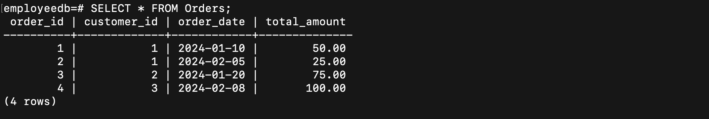

# DBMS JOINS NOTES

## Introduction
 PostgreSQL JOIN statements offer a powerful way to combine data from multiple tables based on shared columns. This enables you to retrieve and analyze diverse information across your database schema. This document explores the fundamental JOIN types in PostgreSQL, along with some special cases.

Basic JOIN Types
# 1. Inner Join:

- Combines rows with matching values in both tables.
- Only returns rows where a join condition is met.
- Ideal for retrieving related data where a one-to-one or one-to-many relationship exists.
### Example
```sql
CREATE TABLE Customers (
  customer_id SERIAL PRIMARY KEY,
  name VARCHAR(255) NOT NULL,
  email VARCHAR(255) UNIQUE NOT NULL
);

CREATE TABLE Orders (
  order_id SERIAL PRIMARY KEY,
  customer_id INTEGER REFERENCES Customers(customer_id) NOT NULL,
  order_date DATE NOT NULL,
  total_amount DECIMAL(10,2) NOT NULL
);

INSERT INTO Customers (name, email) VALUES
  ('John Doe', 'john.doe@example.com'),
  ('Jane Smith', 'jane.smith@example.com'),
  ('Mike Jones', 'mike.jones@example.com');

INSERT INTO Orders (customer_id, order_date, total_amount) VALUES
  (1, '2024-01-10', 50.00),
  (1, '2024-02-05', 25.00),
  (2, '2024-01-20', 75.00),
  (3, '2024-02-08', 100.00);
```
#### Customer Table


#### Orders Table


```sql
SELECT *
FROM Customers c
INNER JOIN Orders o ON c.customer_id = o.customer_id;
```

#### After inner Join


As seen in the above output, the inner join returns a result set that contains row in the left table that matches the row in the right table.

The Venn diagram for INNER JOIN is as below:


## Let's take another example 
```sql
CREATE TABLE zoo_1 (
    id INT PRIMARY KEY,
    animal VARCHAR (100) NOT NULL
);

CREATE TABLE zoo_2 (
    id INT PRIMARY KEY,
    animal VARCHAR (100) NOT NULL
);

INSERT INTO zoo_1(id, animal)
VALUES
    (1, 'Lion'),
    (2, 'Tiger'),
    (3, 'Wolf'),
    (4, 'Fox');
	
INSERT INTO zoo_2(id, animal)
VALUES
    (1, 'Tiger'),
    (2, 'Lion'),
    (3, 'Rhino'),
    (4, 'Panther');
	
	
SELECT *
FROM zoo_1 
INNER JOIN zoo_2 ON zoo_1.animal = zoo_2.animal;

```

### Let's look at the tables how it looks 
Zoo_1 table Looks Like this 


Zoo_2 table Looks Like this


## Now Inner Join of these two tables 


